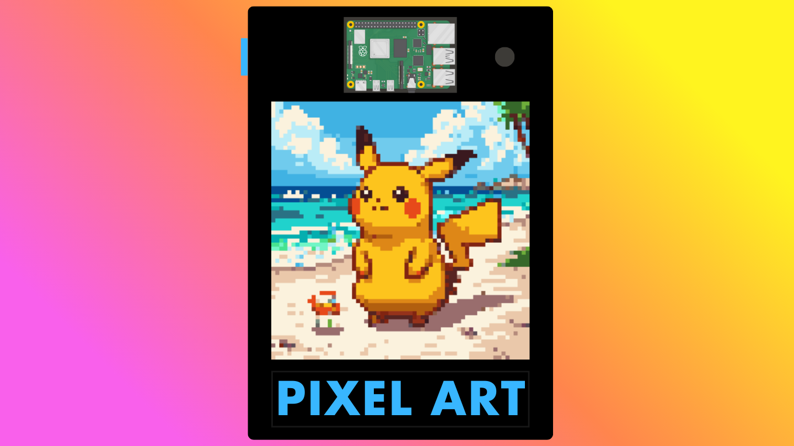

<h1 align="center" color="blue">
  <br>
  Pixel Art
  <br>
</h1>

<h4 align="center">Learn AI and game programming at the edge.</h4>

<p align="center">
  <a href="#key-features">Key Features</a> •
  <a href="#what-is-pixel-art">What is Pixel Art</a> •
  <a href="#why-pixel-art">Why Pixel Art</a> •
  <a href="#how-to-use">How to use</a> •
  <a href="#how-pixel-art-works">How Pixel Art Works</a> •
  <a href="#tutorials">Tutorials</a> •
  <a href="#community-plugins">Community Plugins</a> •
  <a href="#contributions">Contributions</a> •
  <a href="#license">License</a>
</p>

<p align="center">
  
</p>

## Key Features

### Hardware

- edge platform using Raspberry Pi 4
- base build with opt-in components
- very minimal soldering
- customizable case design

### Software

- extendable through RGB, AI, game plugins
- support for RGB plugin development using [rpi-rgb-led-matrix](https://github.com/hzeller/rpi-rgb-led-matrix)
- support for AI plugin development using [Picovoice](https://picovoice.ai)
- support for game plugin development using [Pygame](https://www.pygame.org/wiki/GettingStarted)
- many plugin examples for RGB, AI, and games, ranging from simple to complex
- flexible plugin architecture so you can:
  - build custom plugins using other libraries or APIs (ex. OpenAI)
  - pair RGB with AI or game plugins in one-to-one, one-to-many, or many-to-many relationships
- built-in support for AI plugin audio and image modalities

## What is Pixel Art?

Pixel Art is a fun edge device for learning AI application and game development.
It provides a friendly environment for developers to create their own apps and games through plugins, then transfer those apps, or even integrate some or all of Pixel Art itself, into their own edge projects.

Pixel Art includes a 64x64 LED screen display, microphone, and optional speaker to support image and audio modalities.
Using Raspberry Pi 4 as it's main compute, it can support game development using smaller footprint libraries like Pygame.
It can also support small AI model inferencing locally or API requests to externally-hosted AI models.

The design is opensource under the [MIT](LICENSE) license so developers can customize Pixel Art towards their own learning goals by adding new hardware components, modifying the 3D prints, or creating custom software plugins.

## Why Pixel Art?

Studying various tech over the past several years, I found that developing on a personal or cloud compute often dulls the experience of learning new tech.
In many ways I felt disconnected from the tech I was learning.
The more I learned, the more it all transformed into an obscure blob within a "projects" or "study" folder.

I wanted a platform that made learning more engaging and personalized towards my own learning goals.

This is why I created Pixel Art, for software developers like me who also want to see their learning experience and apps come to life.
A complete learning platform with an open design that can be personalized towards individual learning goals and app deployments.

For education, this means a fun and refreshing development platform that can adapt to new projects and explorations.

If you're also looking to personalize your learning experience, further connect with the apps you're developing, or just really like pixel art, give it a try!

## How to use?

To use Pixel art you'll need to build the device, install the main software, then run existing plugins or create your own.

### Build Device

Visit [hardware](hardware) for a complete hardware build guide.

### Installation and Setup

Now that you have at least a base build of Pixel Art, you are ready to install and setup the main software.

1. Create any required model provider API keys.
For example, the initial configuration of Pixel Art requires a Picovoice API key which you can create with a [free account](https://picovoice.ai/pricing/#compare-our-plans).
Other paid model providers like [Retro Diffusion](https://www.retrodiffusion.ai) and [OpenAI](https://auth.openai.com/create-account) provide API keys which are good to have ready during this setup process, as some plugins require them.

2. ssh into your Pixel Art's raspberry pi using your [password](hardware/README.md#build-steps).

```bash
ssh rpi@pixel.local
```

3. Update the OS and install `git`.

```bash
sudo apt-get update && sudo apt-get install git -y
```

4. Clone this repo into your Pixel Art's `/opt` directory.

```bash
cd /opt && sudo git clone https://github.com/cortesnoel/pixel-art.git
```

5. Run [setup.sh](setup.sh) and follow any of its prompts. This may take a few minutes.

```bash
cd /opt/pixel-art && sudo chmod +x setup.sh && sudo ./setup.sh
```

6. Pixel Art will reboot once `setup.sh` completes.

### Run Existing Plugins

Upon reboot, Pixel Art should begin with the [display_heart_rand](plugins/rgb/random_pixel#display_heart_rand) RGB plugin
and [rd_wake](plugins/ai/retro_diffusion#rd_wake) AI plugin.

Make sure you have a Picovoice API key set as the environment variable `PICOVOICE_TOKEN`.
Pixel Art will fail to run the `rd_wake` plugin without it.

To test different plugins:

1. read the plugin's `README.md` to verify your Pixel Art device meets plugin requirements
1. list only your selected plugins in the [config.toml](config.toml)
1. reboot Pixel Art after any change to the [config.toml](config.toml)

**Note**: Given each plugin may have its own unique [event](#plugin-events) and [data](#passing-data-between-plugins) requirements, not every RGB plugin will be compatible with every AI or game plugin. Read each plugin's docs to know which can be paired together.

### Create Your First Plugin

Visit [Pixel Art Plugin Starter](https://github.com/cortesnoel/pixel-art-plugin-starter) for a complete guide on creating your first RGB, AI, or game plugin.

Also review existing [plugins](plugins) for examples.

## How Pixel Art Works?

### Plugin Events

Pixel Art runs two concurrent pipelines in a continuous loop, one to execute RGB plugins and the other for AI and game plugins. Both AI and game plugins can be thought of generally as "task" plugins.
Plugins are assigned to each of these pipelines in the [config.toml](config.toml) and follow the order they are listed in that file.

These pipelines orchestrate the timing of plugin execution through the use of plugin decorators `@RGBEvents()`, `@PicoEvents()`, and others that control the corresponding thread events. For example, the plugin decorators listed previously are meant to pair one RGB plugin to one task plugin (one-to-one relationship).

Generally, the event flow for a one-to-one plugin relationship is as follows:

1. AI plugin waits
1. RGB plugin starts
1. AI plugin starts
1. AI plugin ends
1. RGB plugin ends

If you instead want to pair one RGB plugin to two task plugins (one-to-many relationship), you would list in the [config.toml](config.toml) one RGB plugin that uses the `@RGBEvents()` plugin decorator and two task plugins that use the `@PicoEventStart()` and `@PicoEventEnd()` plugin decorators, respectively.

For game plugins, the `@AIGame()` plugin decorator also embeds the `@PicoEvents()` plugin decorator and so follows the same event handling.

### Plugin Decorators

There are many more plugin decorators to help you with quickly writing plugins, such as `@PicoModels()` which let's you quickly initialize Picovoice AI models for use within your AI or game plugin. For more info on plugin decorator use and their definitions, review the parent plugin modules and existing plugin examples in [plugins](plugins).

### Passing Data Between Plugins

Data can be passed between plugins in two ways:

1. AI -> AI: An AI plugin can pass data to the next AI plugin through its `return` statement. Depending on the number of values returned, the second AI plugin must accept the same number of parameters and match parameter names listed in the [ai_hook](plugin_manager/hook_spec.py) hookspec.

1. AI -> RGB: An AI plugin can pass data to its paired RGB plugin by sending it through the `ai_result_queue`. The RGB plugin must read this queue to get the data.

## Tutorials

*TBD*

## Community Plugins

**Note**: Always review and verify community plugins for errors and vulnerabilities prior to install or use.

*TBD*

## Contributions

### Core

Safety, security, and bug fix contributions are welcome for both Pixel Art hardware and software.

First open an issue containing a general description and potential solution. This allows for triage of issues with maintainer(s) prior to any PR, to verify work aligns with the direction of Pixel Art.

### Plugins

Plugin contributions are welcome and encouraged. Open an issue or PR for the plugin(s) you would like to contribute.

Robust plugins with popular features may be added to Pixel Art [plugins](plugins) directly. To keep the `plugins` directory from growing too large over time, alternatively your plugin can be referenced as an external repo in the [Community Plugins](#community-plugins) section.

## License

[MIT](LICENSE)

---

> LinkedIn [Noel Cortes](https://www.linkedin.com/in/noel-cortes-00ab8b181/)
&nbsp;&middot;&nbsp;
> Instagram [@noelcortes.libre](https://www.instagram.com/noelcortes.libre/)
