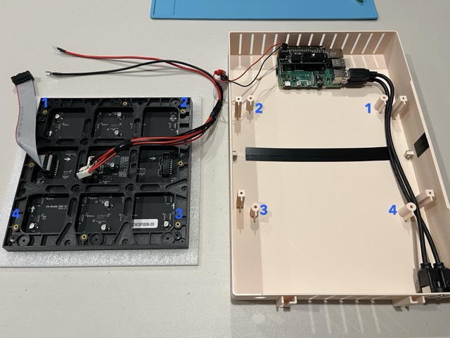

<h1 align="center" color="blue">
   
  Hardware Build Guide
   
</h1>

  

## Parts

Welcome! To begin, buy all the [parts](BOM.md) for a Pixel Art base build, including for any additional features (ex. game controller).

## Build steps

1. Setup Raspberry Pi by following the official guide [Install an operating system](https://www.raspberrypi.com/documentation/computers/getting-started.html#installing-the-operating-system).
    - Install the Raspberry Pi OS Lite (64-bit)
    - Set your Wi-Fi credentials
    - Enable SSH and save password for later use

1. 3D print all [3mf files](prints) for the Pixel Art case (also the RGB matrix spacer not shown here).
   Tested on a Bambu Lab X1C 3D printer.
      

1. Prepare RGB Bonnet by soldering necessary pins.
    - Solder a jumper wire between `GPIO4` and `GPIO18`
      
    - Melt a blob of solder on the bottom solder jumper so the middle pad is "shorted" to `8`
      
    - Optional [ Button ]: Solder alligator clip wires to `SCL` and `GND`
      

1. Connect RGB Bonnet to Raspberry Pi 4 using 2x20 pin riser header.
 
  

1. Tape top and bottom case together to keep the case steady.
  

1. Screw top and bottom case together with 2 x M3x8mm screws and nuts.
  

1. Screw Raspberry Pi onto case with 2 x M2.5x4mm and 2 x M2.5x20mm.
  

1. Optional [ Panel Mount USB ]: Screw in USB panel mounts and plug into Raspberry Pi USB 2.0 ports.
  

1. Plug in power cables by feeding cables through the case's power cable hole (hole printed with slit if needed to cut open).
  

1. Optional [ Button ]: Attach button to case and attach RGB Bonnet alligator clips to button.
  

1. Attach RGB matrix by aligning matrix screw holes with the four circle stands in case. Screw in from back of the case using 4 x M3x12mm screws.
*Warning*: Treat RGB matrix as fragile or else you risk permanently damaging the LEDs.
  

1. Connect RGB matrix data and power cables to the RGB Bonnet.
  

1. Connect speaker to Raspberry Pi USB 3.0 port. If keeping speaker inside the case, use an adhesive to keep from moving and potentially damaging the RGB LED matrix.
Alternatively, you can plugin from outside the case if Panel Mount USB is installed.
  

1. Cut your RGB diffuser acrylic to size 195mm x 214mm. Cut your Raspberry Pi clear acrylic to size 60mm x 94mm. You can use an acrylic scoring tool to cut sizes.
  

1. Drill 1/8in holes into RGB diffuser acrylic using the RGB matrix spacer's print holes as guides, this way holes align exactly.
*Warning*: Drill slow and work up drill bit sizes to avoid chipping or cracking acrylic's edge.
  

1. Stack the RGB matrix spacer, then RGB diffuser acrylic (rough side down), onto the RGB matrix.
   Align holes with the case's square stands and screw into the case using 4 x M3x20mm screws.
 
 

1. Tape or glue clear acrylic to top cover.
  

1. Screw nameplate onto bottom cover using 4 x M3x6mm screws and nuts.
  

1. Plug in microphone to Raspberry Pi USB 3.0 port and clip onto top cover's microphone tab.
  

1. Snap on top and bottom cover.
  

1. Power on Pixel Art!
Below is an example of an image generated by [Retro Diffusion Plugins](../plugins/ai/retro_diffusion/README.md).
  
