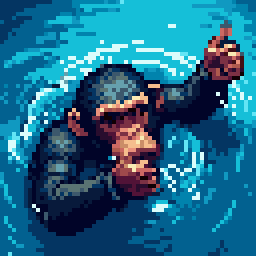
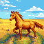
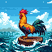
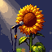

<h1 align="center">Retro Diffusion</h1>
<br>
<p align="center">
  AI Plugin to generate images using <a href="https://www.retrodiffusion.ai">Retro Diffusion</a>.
</p>

<br>
<p align="center">
  
  
  
  
  
</p>

## Requirements

### Hardware

The following Pixel Art I/O hardware is required to support this plugin: `microphone`, `speaker`.

### API Keys

The following API keys must be set as system environment variables:

- [Picovoice](https://console.picovoice.ai/signup#free): `PICOVOICE_TOKEN`
- [Retro Diffusion](https://www.retrodiffusion.ai): `RETRO_DIFFUSION_TOKEN`

## Plugins

1. [rd_wake](#rd_wake)
1. [rd_speech_to_text](#rd_speech_to_text)
1. [rd_text_to_image](#rd_text_to_image)

---

### `rd_wake`

Listens for the wake phrase "Hey Pixel Art." Once the wake phrase is detected, this plugin exits.

#### Modalities

- **in**: audio
- **out**: none

#### Usage

Pair with an RGB plugin that expects no values from the `ai_result_queue`.

For example, pair with the Random Pixel [display_smiley_rand](../../rgb/random_pixel/README.md#display_smiley_rand) RGB plugin.

##### Steps

1. Set in Pixel Art's [config.toml](../../../config.toml):
```toml
[plugins]

ai = [
  # retro diffusion
  "retro_diffusion_plugins.RetroDiffusionPlugins.rd_wake" # this plugin
]

rgb = [
  # retro diffusion
  "random_pixel_plugins.RandomPixelPlugins.display_smiley_rand"
]
```
2. Launch or restart Pixel Art
3. `rd_wake`: Say "Hey Pixel Art!"

---

### `rd_speech_to_text`

Records speech for a configurable amount of time and then transcribes the speech.
Transcribed speech is then forwarded as a string value to the next AI plugin.

#### Modalities

- **in**: audio
- **out**: text

#### Usage

Pair with an RGB plugin that expects no values from the `ai_result_queue`.

For example, pair with the Fill Screen [display_strobe_fill](../../rgb/fill_screen/README.md#display_strobe_fill) RGB plugin.

##### Steps

1. Set in Pixel Art's [config.toml](../../../config.toml):
```toml
[plugins]

ai = [
  # retro diffusion
  "retro_diffusion_plugins.RetroDiffusionPlugins.rd_wake",
  "retro_diffusion_plugins.RetroDiffusionPlugins.rd_speech_to_text" # this plugin
]

rgb = [
  # retro diffusion
  "random_pixel_plugins.RandomPixelPlugins.display_smiley_rand",
  "fill_screen_plugins.FillScreenPlugins.display_strobe_fill"
]
```
2. Launch or restart Pixel Art
3. `rd_wake`: Say "Hey Pixel Art!"
4. `rd_speech_to_text`: Describe to Pixel Art the image you would like to create

---

### `rd_text_to_image`

Generates a new image from a description text using [Retro Diffusion AI](https://www.retrodiffusion.ai).
The image description is a string value returned by the AI plugin that was executed previous to this plugin.

For example, set [rd_speech_to_text](#rd_speech_to_text) previous to this plugin in the AI plugin pipeline.
It will record your speech and return its transcription. Then this plugin will use the transcription as the
image description for generating a new image.

#### Modalities

- **in**: text
- **out**: image

#### Usage

Pair with an RGB plugin that expects an image path value from the `ai_result_queue`.

For example, pair with the Display Image [display_image](../../rgb/display_image/README.md#display_image) RGB plugin.

##### Steps

1. Set in Pixel Art's [config.toml](../../../config.toml):
```toml
[plugins]

ai = [
  # retro diffusion
  "retro_diffusion_plugins.RetroDiffusionPlugins.rd_wake",
  "retro_diffusion_plugins.RetroDiffusionPlugins.rd_speech_to_text",
  "retro_diffusion_plugins.RetroDiffusionPlugins.rd_text_to_image" # this plugin
]

rgb = [
  # retro diffusion
  "random_pixel_plugins.RandomPixelPlugins.display_smiley_rand",
  "fill_screen_plugins.FillScreenPlugins.display_strobe_fill",
  "display_image_plugins.DisplayImagePlugins.display_image"
]
```
2. Launch or restart Pixel Art
3. `rd_wake`: Say "Hey Pixel Art!"
4. `rd_speech_to_text`: Describe to Pixel Art the image you would like to create
5. `rd_text_to_image`: Generates new image from the description
6. See new image on the Pixel Art screen

#### Examples

<p align="left">
  
  
  
  
  
</p>

---

## Configuration

Plugin configurations can be set in [plugin.toml](plugin.toml).

## Troubleshoot

TBD

## License

[MIT](LICENSE)
