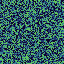

<h1 align="center">Random Pixel</h1>
<br>
<p align="center">RGB Plugin to display fullscreen patterns on the Pixel Art screen.</p>

<br>
<p align="center">
  
  
</p>

## Requirements

Basic build of Pixel Art.

Reference your chosen AI or game plugin(s) for additional requirements.

## Plugins

1. [display_strobe_fill](#display_strobe_fill)
1. [display_scatter_fill](#display_scatter_fill)

---

### `display_strobe_fill`

Display a strobe-like pattern on the Pixel Art screen.

#### Usage

Pair with an AI plugin meant for background tasks. This plugin doesn't use any value from the `ai_result_queue`.

For example, pair with the Retro Diffusion [rd_wake](../../ai/retro_diffusion/README.md#rd_wake) AI plugin.

##### Steps

1. Set in Pixel Art's [config.toml](../../../config.toml):
```toml
[plugins]

ai = [
  # retro diffusion
  "retro_diffusion_plugins.RetroDiffusionPlugins.rd_wake"
]

rgb = [
  # retro diffusion
  "fill_screen_plugins.FillScreenPlugins.display_strobe_fill" # this plugin
]
```
2. Launch or restart Pixel Art
3. View strobe pattern on screen
4. `rd_wake`: Say "Hey Pixel Art!"

#### Examples


---

### `display_scatter_fill`

Display a scattered multi-color pattern on the Pixel Art screen.

#### Usage

Pair with an AI plugin meant for background tasks. This plugin doesn't use any value from the `ai_result_queue`.

For example, pair with the Retro Diffusion [rd_wake](../../ai/retro_diffusion/README.md#rd_wake) AI plugin.

##### Steps

1. Set in Pixel Art's [config.toml](../../../config.toml):
```toml
[plugins]

ai = [
  # retro diffusion
  "retro_diffusion_plugins.RetroDiffusionPlugins.rd_wake"
]

rgb = [
  # retro diffusion
  "fill_screen_plugins.FillScreenPlugins.display_scatter_fill" # this plugin
]
```
2. Launch or restart Pixel Art
3. View scattered multi-color pattern on screen
4. `rd_wake`: Say "Hey Pixel Art!"

#### Examples


---

## Configuration

Plugin configurations can be set in [plugin.toml](plugin.toml).

## Troubleshoot

TBD

## License

[MIT](LICENSE)
